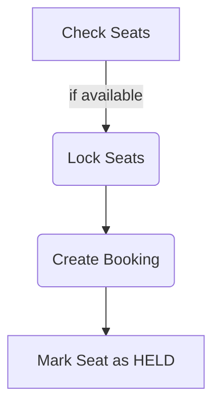

# Movie Ticket Booking System

## Check
- FR -> each show belongs to exactly one auditorium

## Running Locally

Start Postgres

```bash
CREATE SCHEMA <schema_name>;

GRANT ALL PRIVILEGES ON SCHEMA {schema_name} TO {user_name};
```

Run Alembic: Look at alembic read my

Then run the app

```
python3 -m uvicorn app.main:app --reload --host 127.0.0.1 --port 8000
```

## Functional Requirements

The system should support:
- Create movies.
- Create theaters.
    - Add auditoriums/screens to theaters.
        - Configure physical seats inside an auditorium.
        - Generate sellable seat inventory for that show.
    - Schedule a movie show.
- Search/list shows.
- View seat availability for a show.
- Temporarily hold one or more seats.
- Confirm a booking after payment succeeds.
- Cancel a held booking.
- Retrieve booking details.
- Prevent two users from booking the same seat.

## Non Functional Requirements
- Make booking creation idempotent.
- Make payment confirmation idempotent.

Separations
```
HTTP/API
   ↓
Application services
   ↓
Repositories
   ↓
Domain models
   ↓
PostgreSQL
```

Extensibility:
- Should be able to add cancellation policies
- Dynamic Pricing
- coupons
- sear categories
- notifications

Testability:
- services should depend on repositories rather than hard coded database calls

Consistency:
- Either the Seat is selected or not. Clear selection

Transactional:


Concurrency Solution:
TODO: 

## Assumptions

For this implementation:
- currency is fixed to INR
- payment processing itself is external
- payment_reference represents successful payment
- authentication is outside scope
- seats can be held for five minutes
- after five minutes, an unconfirmed hold becomes reclaimable
- seats cannot change after the show inventory has been generated
- movie/show administration is assumed trusted

### In Scope
```
Movies
Theaters
Auditoriums
Physical seats
Shows
Show-specific seat inventory
Seat availability
Seat holds
Booking confirmation
Cancellation
Concurrency protection
Idempotency
PostgreSQL persistence
REST API
Alembic
Unit tests
Integration tests
```

### Out of Scope
```
Authentication
Authorization
Real payment gateway
Refund processing
Email/SMS
Coupons
Food ordering
Recommendation engine
Distributed locking
Kafka/event streaming
Multi-region architecture
```

## Entities

### Actors

#### Customer

