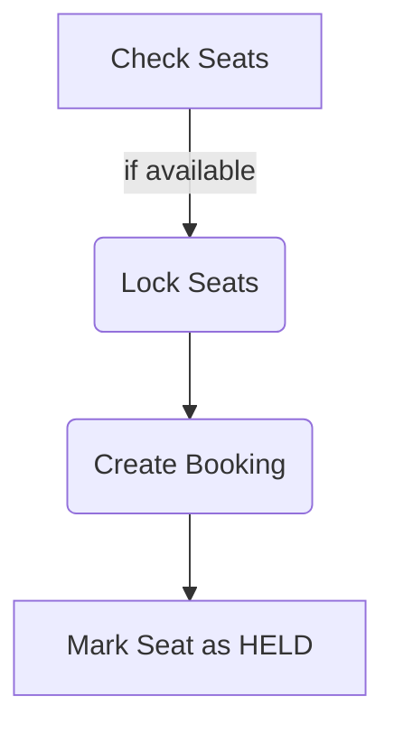
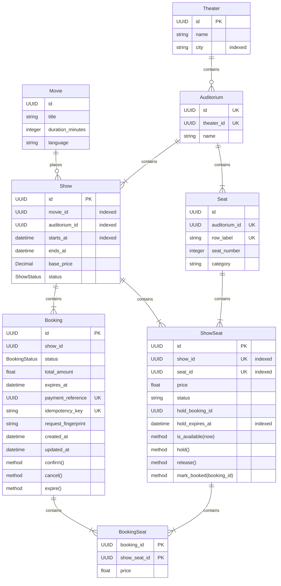
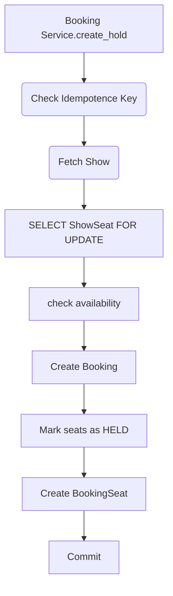
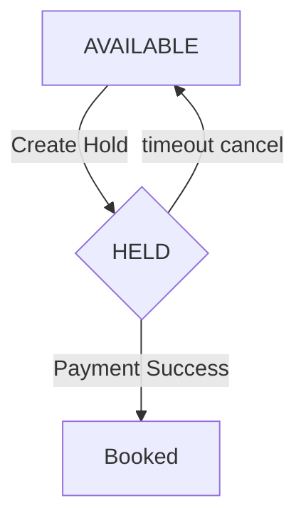
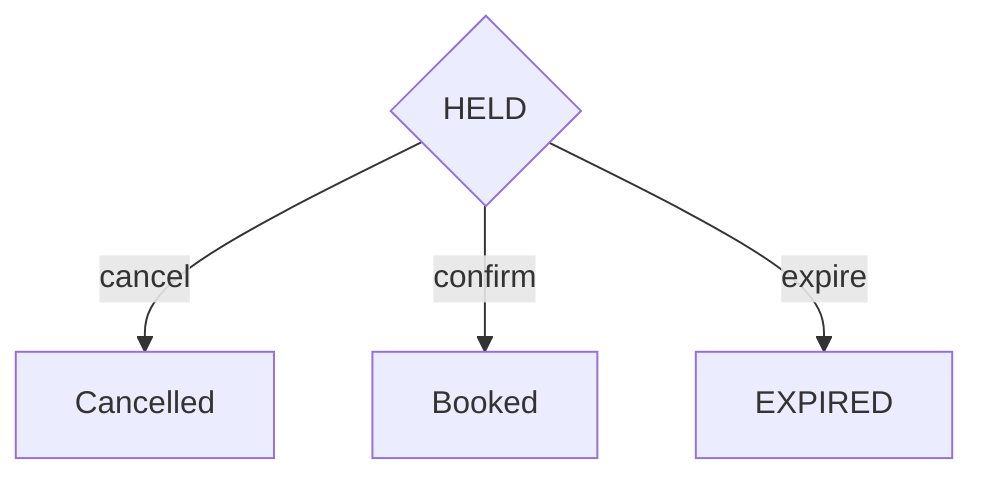

# Movie Ticket Booking System

## Check
- FR -> each show belongs to exactly one auditorium

## Running Locally

Start Postgres

```bash
CREATE SCHEMA <schema_name>;

GRANT ALL PRIVILEGES ON SCHEMA {schema_name} TO {user_name};
```

Run Alembic: Look at alembic read my

Then run the app

```
python3 -m uvicorn app.main:app --reload --host 127.0.0.1 --port 8000
```

### Docs

```
http://127.0.0.1:8000/docs
```

## Functional Requirements

The system should support:
- Create movies.
- Create theaters.
    - Add auditoriums/screens to theaters.
        - Configure physical seats inside an auditorium.
        - Generate sellable seat inventory for that show.
    - Schedule a movie show.
- Search/list shows.
- View seat availability for a show.
- Temporarily hold one or more seats.
- Confirm a booking after payment succeeds.
- Cancel a held booking.
- Retrieve booking details.
- Prevent two users from booking the same seat.

## Non Functional Requirements
- Make booking creation idempotent.
- Make payment confirmation idempotent.

Separations
```
HTTP/API
   ↓
Application services
   ↓
Repositories
   ↓
Domain models
   ↓
PostgreSQL
```

Extensibility:
- Should be able to add cancellation policies
- Dynamic Pricing
- coupons
- sear categories
- notifications

Testability:
- services should depend on repositories rather than hard coded database calls

Consistency:
- Either the Seat is selected or not. Clear selection

Transactional:


Concurrency Solution:
TODO: 

## Assumptions

For this implementation:
- currency is fixed to INR
- payment processing itself is external
- payment_reference represents successful payment
- authentication is outside scope
- seats can be held for five minutes
- after five minutes, an unconfirmed hold becomes reclaimable
- seats cannot change after the show inventory has been generated
- movie/show administration is assumed trusted

### In Scope
```
Movies
Theaters
Auditoriums
Physical seats
Shows
Show-specific seat inventory
Seat availability
Seat holds
Booking confirmation
Cancellation
Concurrency protection
Idempotency
PostgreSQL persistence
REST API
Alembic
Unit tests
Integration tests
```

### Out of Scope
```
Authentication
Authorization
Real payment gateway
Refund processing
Email/SMS
Coupons
Food ordering
Recommendation engine
Distributed locking
Kafka/event streaming
Multi-region architecture
```

## Entities



## Critical Booking Workflow



### Why select ShowSeat FOR UPDATE Matters

Suppose:
```
Transaction A wants A1
Transaction B wants A1
```
Both querying:
```sql
SELECT ...
FOR UPDATE
```
causes:
```
A obtains lock
B blocks
```
A changes:
```
AVAILABLE -> HELD
```
and commits.

B wakes up and sees:
```
HELD
```
and returns:
```
409 Conflict
```
Without locking:
```
A reads AVAILABLE
B reads AVAILABLE
A writes HELD
B writes HELD
```
The system could sell the same logical seat twice.

### State Machines
Show Seat

Booking


## Challenges

“Why not reserve directly in BookingSeat?”

> Because I need a single mutable per-show inventory row that can be atomically locked.

“What happens when two users buy the same seat?”
```
Both transactions issue:

SELECT FOR UPDATE

One acquires the row first.

The other waits and then observes the changed state.
```
“What if the client retries?”

> Idempotency-Key.

“What if payment callback is repeated?”
```
Confirmation is idempotent when the same:

payment_reference

is supplied.
```
“What if two requests use the same payment reference?”
```
Database:

UNIQUE(payment_reference)

provides the final guarantee.
```
“What if the application crashes after payment but before confirmation?”
```
That's a distributed transaction between the payment provider and our database.

A production extension would introduce:

payment records
payment webhook reconciliation
idempotent callbacks
outbox/event processing
```
The local DB transaction alone cannot solves that problem.