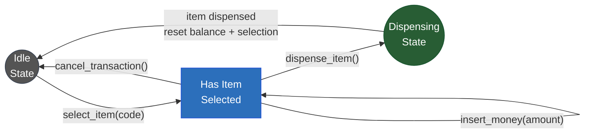
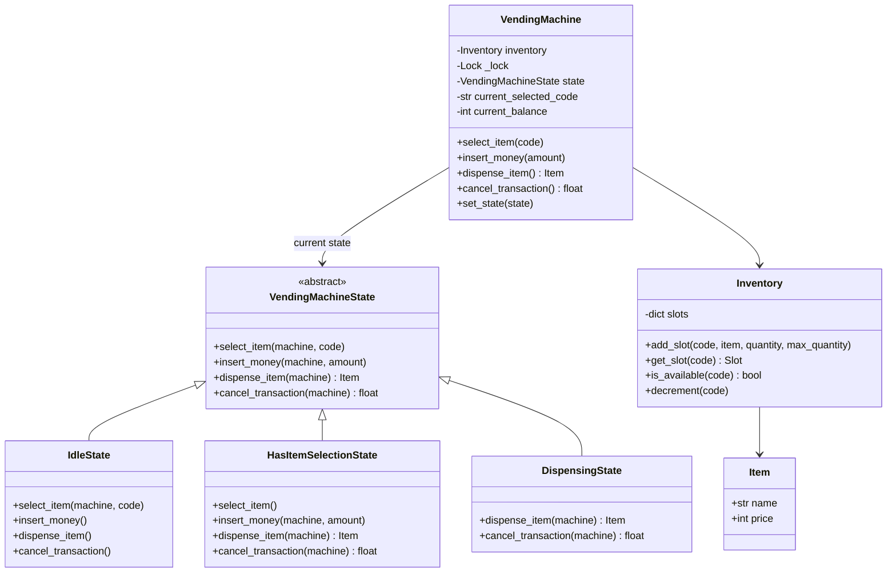

# Requirements

## Functional Requirements:

## Flow Diagram

```mermaid
flowchart LR
    IdleState((Idle\nState)) -- "select_item(code)" --> HasItemSelectionState["Has Item\nSelected"]
    HasItemSelectionState -- "insert_money(amount)" --> HasItemSelectionState
    HasItemSelectionState -- "dispense_item()" --> DispensingState((Dispensing\nState))
    HasItemSelectionState -- "cancel_transaction()" --> IdleState
    DispensingState -- "item dispensed\nreset balance + selection" --> IdleState

    style IdleState       fill:#545454,stroke:#374151,color:#ffffff
    style HasItemSelectionState fill:#2c6fbb,stroke:#1d4ed8,color:#ffffff
    style DispensingState fill:#285d34,stroke:#14532d,color:#ffffff
```

### Class Diagram

```mermaid
classDiagram
    class VendingMachine {
        -Inventory inventory
        -Lock _lock
        -VendingMachineState state
        -str current_selected_code
        -int current_balance
        +select_item(code)
        +insert_money(amount)
        +dispense_item() Item
        +cancel_transaction() float
        +set_state(state)
    }

    class VendingMachineState {
        <<abstract>>
        +select_item(machine, code)
        +insert_money(machine, amount)
        +dispense_item(machine) Item
        +cancel_transaction(machine) float
    }

    class IdleState {
        +select_item(machine, code)
        +insert_money() 
        +dispense_item()
        +cancel_transaction()
    }

    class HasItemSelectionState {
        +select_item()
        +insert_money(machine, amount)
        +dispense_item(machine) Item
        +cancel_transaction(machine) float
    }

    class DispensingState {
        +dispense_item(machine) Item
        +cancel_transaction(machine) float
    }

    class Inventory {
        -dict slots
        +add_slot(code, item, quantity, max_quantity)
        +get_slot(code) Slot
        +is_available(code) bool
        +decrement(code)
    }

    class Item {
        +str name
        +int price
    }

    VendingMachine --> VendingMachineState : current state
    VendingMachine --> Inventory
    VendingMachineState <|-- IdleState
    VendingMachineState <|-- HasItemSelectionState
    VendingMachineState <|-- DispensingState
    Inventory --> Item
```